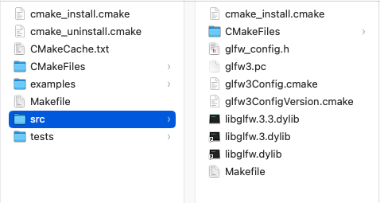
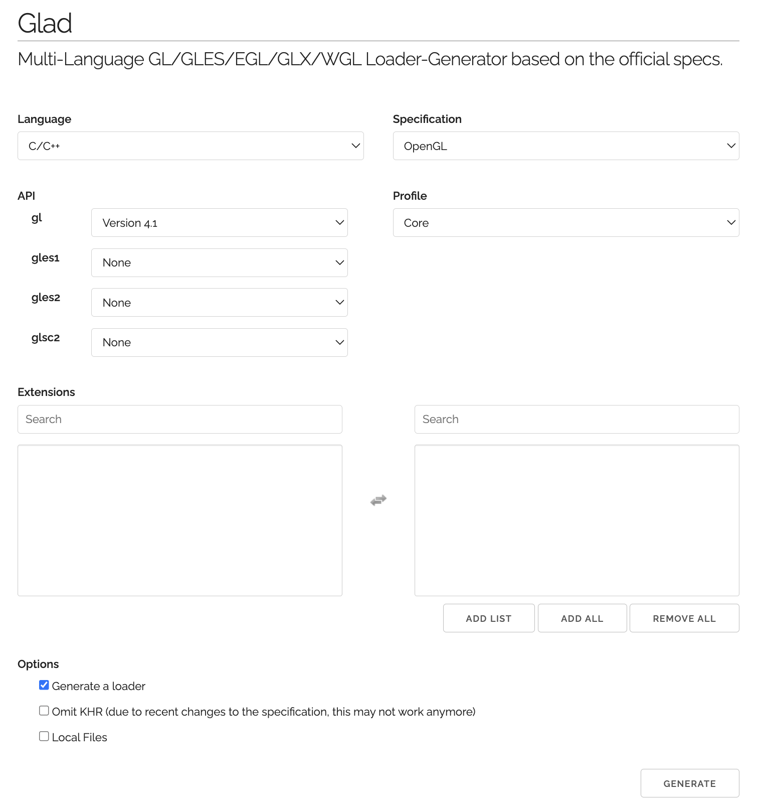

## Introduction

## Lib Config (MAC)

### GLFW

1.  download [source code](https://www.glfw.org/download.html)
2.  cmake build source code
    
3.  build lib. You can find lib file in the directory src

```
cd build
make
```



4. create directory `includes` and `lib`

5. copy GLFW directory to `includes`, and lib file to `lib` directory

### GLAD

1. Download `glad.zip` [online](https://glad.dav1d.de/)
   
2. Copy both header directory `glad` and `KHR` to directory `includes`
3. Copy file `glad.c` to project directory `src`
